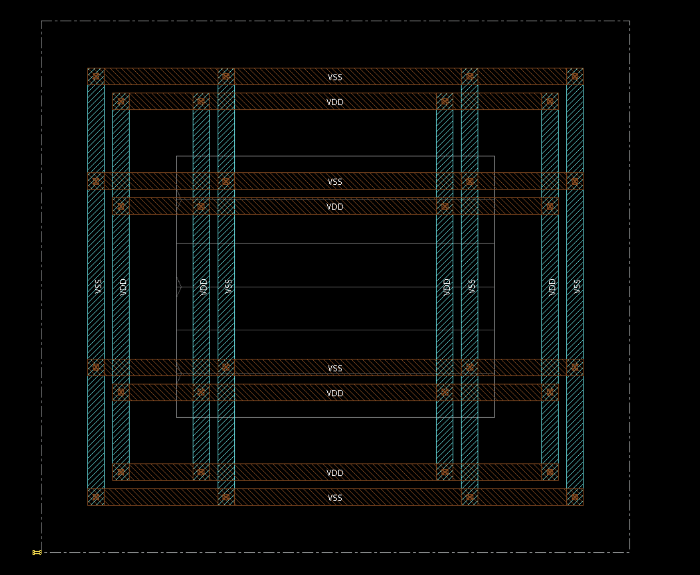
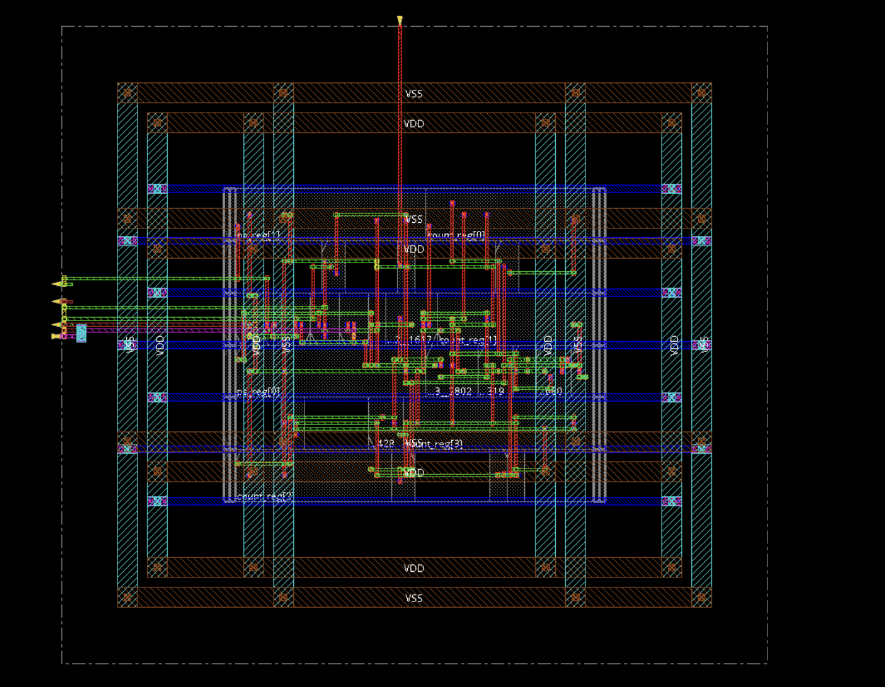

<h1 align="center">🚦 Traffic Light Controller</h1>

<p align="center">
<b>Moore FSM ⇄ Mealy FSM</b><br>
Design and implementation of a Traffic Light Controller using Verilog HDL.
</p>

<p align="center">


</p>

---

## 📖 Project Overview

This project implements a **Traffic Light Controller** using **Moore** and **Mealy Finite State Machines (FSM)** in **Verilog HDL**. The controller manages traffic at a four-way intersection by controlling the **North–South** and **East–West** traffic signals.

The project covers the complete hardware design workflow, including **RTL design, simulation, waveform analysis, logic synthesis, physical design, and performance comparison**.

---

## 🛠️ Tools & Technologies

| Tool | Purpose |
|------|---------|
| Verilog HDL | Hardware Description Language |
| EDA Playground | Verilog Coding & Simulation |
| EPWave | Waveform Viewer |
| Cadence Genus | Logic Synthesis |
| Cadence Innovus | Physical Design |

---

## ✨ Features

- 🚦 Four-Way Traffic Light Controller
- 🔄 Moore FSM Implementation
- ⚡ Mealy FSM Implementation
- 🧪 Verilog Testbenches
- 📈 Waveform Analysis
- 🏗️ RTL Design & Physical Design
- 📊 Performance Comparison

---

## 📂 Repository Structure

```text
Traffic-Light-Controller-FSM/
│
├── Moore_FSM.v
├── Moore_Testbench.v
├── Mealy_FSM.v
├── Mealy_Testbench.v
├── README.md
├── Requirements.md
└── Screenshots/
```

---

## 🚥 Moore vs Mealy FSM

| Feature | Moore FSM | Mealy FSM |
|----------|-----------|-----------|
| Output | Depends only on the current state | Depends on the current state and inputs |
| Response | Stable and predictable | Faster response to input changes |
| Complexity | Low | Moderate |
| Timing | Fixed | Adaptive |

---

# 📸 Project Screenshots

> ℹ️ Detailed explanations for each screenshot are available in the **[Screenshots](Screenshots/)** folder.

### FSM State Diagrams

<p align="center">


</p>

---

### Simulation Waveforms

<p align="center">


</p>

---

### Post Synthesis Circuits

<p align="center">


</p>

---

### Physical Design Flow

<p align="center">


</p>

<p align="center">


</p>

---

### Performance Reports

<p align="center">


</p>

---

### Final Comparison

<p align="center">

</p>

---

## 📊 Results

✔ Successfully designed and simulated Moore and Mealy FSMs.

✔ Verified functionality using EPWave waveforms.

✔ Performed logic synthesis using Cadence Genus.

✔ Completed physical design using Cadence Innovus.

✔ Compared both implementations based on **area, power, timing, and performance**.

---

<p align="center">
⭐ If you found this project helpful, consider giving it a star!
</p>
